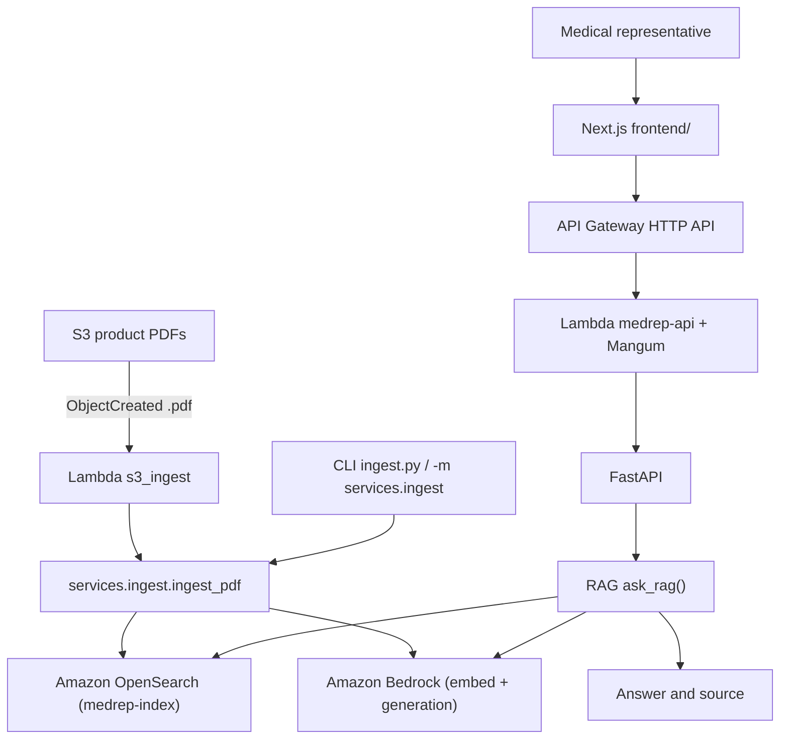

# Architecture

The backend uses Python and FastAPI with a layered package layout under `backend/` (`api/schema`, `services`, `repositories`, `handlers`).

Product PDFs in S3 are ingested into OpenSearch (`medrep-index`) with RAG fields `{text, source, embedding}` plus ingest metadata (`document_id`, `chunk_id`, `product_name`, `document_type`, `source_filename`, `s3_key`, `page_number`, and optional `section_name` / `document_version` / `effective_date`):

1. **S3 ObjectCreated** (suffix `.pdf`) invokes Lambda `handlers.s3_ingest.handler` (thin function package built from the repo-root Makefile; handler source under `backend/handlers/`).
2. Shared ingest code and deps ship as a Lambda Layer (`python/services` + `python/repositories` copied from `backend/` at `sam build`, plus ingest deps). The handler calls `services.ingest.ingest_pdf` (download → page-aware PyPDF extract → clean → paragraph/section token chunk → Titan embed via Bedrock → delete prior `document_id` and legacy same-filename orphans → index with deterministic `chunk_id`).
3. The same ingest service is available via CLI: `python ingest.py --bucket … --key …` or `python -m services.ingest` (optional `--chunk-size` / `--chunk-overlap`, or env `INGEST_CHUNK_SIZE` / `INGEST_CHUNK_OVERLAP`; defaults 400 / 40 whitespace tokens).

Objects uploaded before the S3 notification existed are not auto-ingested; re-upload or run the CLI for backfill. Live deploy and one-PDF verification are operator steps (see `docs/technical/backend.md`).

The RAG module (`ask_rag` in `backend/services/rag.py`) embeds questions with Amazon Bedrock, retrieves from Amazon OpenSearch, and generates answers with Amazon Bedrock. `POST /chat` is wired to `ask_rag` and is rate-limited in-process per authenticated user (or IP fallback). `POST /agent-chat` uses the same auth, rate limit, and `ChatResponse` shape (`answer`, `source`, `citations`) via `ask_agent`: a multi-step LangChain agent that may greet or small-talk without tools via model intent; for product/medical questions the prompt requires `search_internal_documents` (possibly repeatedly) and evidence-only answers, with safe refusal after unsuccessful tool use or empty evidence (DailyMed is not on this path). The Python gate does not classify messages or block every ungrounded first-turn product reply if tools are skipped. `GET /health` is an unauthenticated liveness check that does not call AI dependencies. API responses carry `X-Request-ID`; application errors use a consistent `{error: {code, message, request_id}}` envelope.

The synchronous web API is hosted separately from ingestion: **API Gateway HTTP API → Lambda (`medrep-api`) → Mangum → FastAPI** (`infra/api-template.yaml`). Operator steps (validate/build/deploy, AOSS data-access policy for the API role, teardown) are in `docs/api-deployment.md`. Do not merge this stack with the S3 ingest SAM template.

The frontend is a Next.js App Router app under `frontend/`. It defaults to `POST /chat` and can switch to `POST /agent-chat` via a Chat / Agent mode toggle, using `NEXT_PUBLIC_API_BASE_URL` and attaching `Authorization: Bearer` from the in-memory Google ID token (`lib/auth.tsx` → `lib/api.ts`). Sign-in uses Google Identity Services. The backend verifies Google ID tokens on `POST /chat` and `POST /agent-chat` (audience `GOOGLE_CLIENT_ID`) via `api.auth.require_google_user`. Auth failures (missing token / 401) sign the user out on the chat page.

