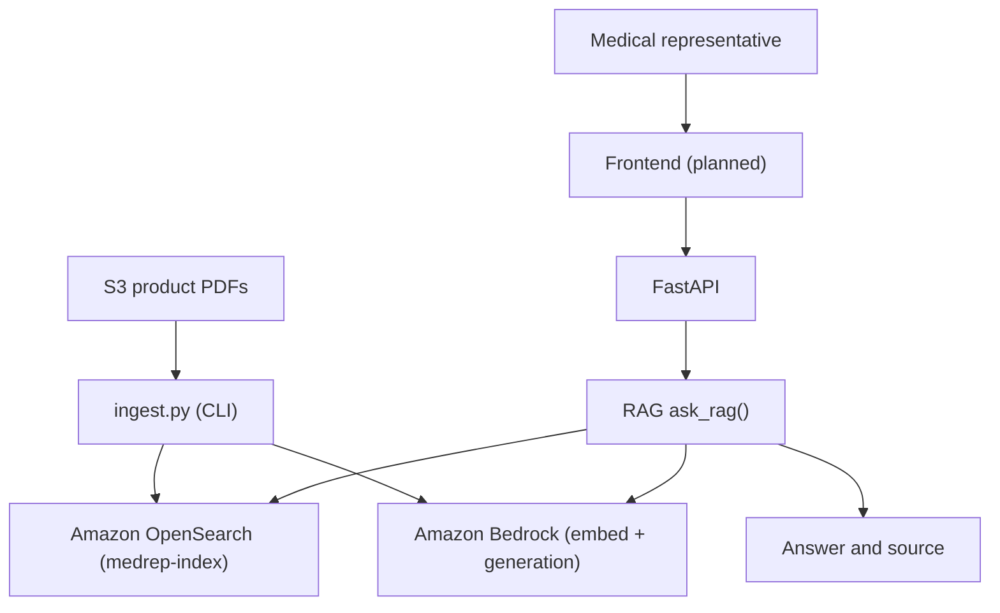

# Architecture

The backend uses Python and FastAPI.

Product PDFs in S3 are ingested by `backend/ingest.py` (script/CLI, not an HTTP API): extract text with PyPDF, chunk, embed with Amazon Titan Embeddings via Bedrock, and index into OpenSearch (`medrep-index`) with fields `{text, source, embedding}`.

The RAG module (`ask_rag` in `backend/rag.py`) embeds questions with Amazon Bedrock, retrieves from Amazon OpenSearch, and generates answers with Amazon Bedrock. `POST /chat` is wired to `ask_rag`.

The frontend remains planned.

