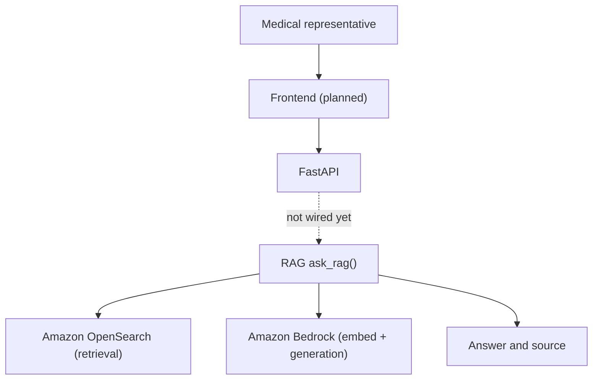

# Architecture

The backend uses Python and FastAPI.

The RAG module (`ask_rag` in `backend/rag.py`) embeds questions with Amazon Bedrock, retrieves from Amazon OpenSearch, and generates answers with Amazon Bedrock. It is not yet connected to `POST /chat`.

The frontend remains planned.

