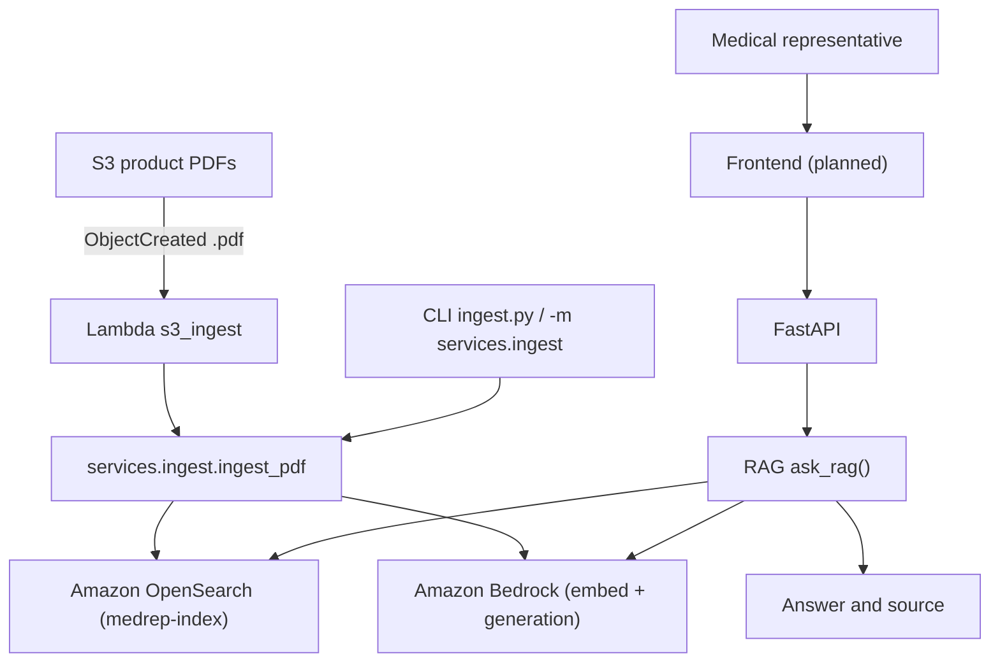

# Architecture

The backend uses Python and FastAPI with a layered package layout under `backend/` (`api/schema`, `services`, `repositories`, `handlers`).

Product PDFs in S3 are ingested into OpenSearch (`medrep-index`) with fields `{text, source, embedding}`:

1. **S3 ObjectCreated** (suffix `.pdf`) invokes Lambda `handlers.s3_ingest.handler` (thin function package built from the repo-root Makefile; handler source under `backend/handlers/`).
2. Shared ingest code and deps ship as a Lambda Layer (`python/services` + `python/repositories` copied from `backend/` at `sam build`, plus ingest deps). The handler calls `services.ingest.ingest_pdf` (download → PyPDF extract → chunk → Titan embed via Bedrock → index).
3. The same ingest service is available via CLI: `python ingest.py --bucket … --key …` or `python -m services.ingest`.

Objects uploaded before the S3 notification existed are not auto-ingested; re-upload or run the CLI for backfill. Live deploy and one-PDF verification are operator steps (see `docs/technical/backend.md`).

The RAG module (`ask_rag` in `backend/services/rag.py`) embeds questions with Amazon Bedrock, retrieves from Amazon OpenSearch, and generates answers with Amazon Bedrock. `POST /chat` is wired to `ask_rag`.

The frontend remains planned.

