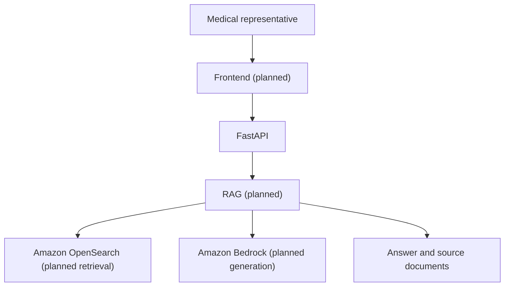

# Architecture

The backend uses Python and FastAPI.

The frontend, RAG, Amazon OpenSearch, and Amazon Bedrock are planned.

Amazon OpenSearch is planned for retrieval. Amazon Bedrock is planned for LLM generation.

