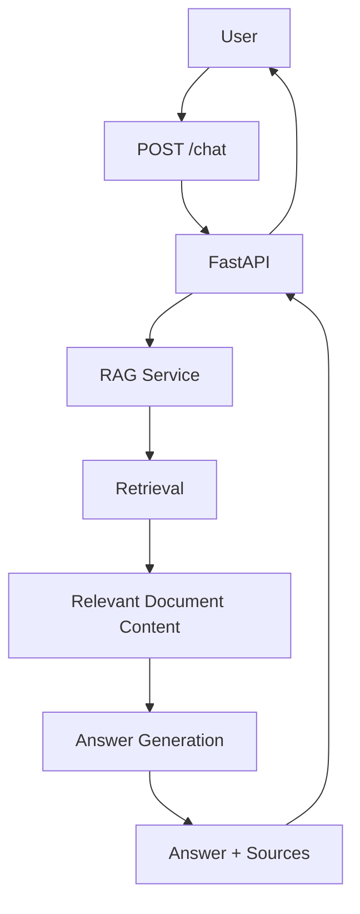

# Backend Technical Design

## Overview

The MedRep AI backend is responsible for receiving user questions, coordinating the question-answering flow, and returning answers with source information.

The backend is written in Python and uses FastAPI.

The current backend API is centered on:

`POST /chat`

As the project grows, the backend will coordinate the RAG flow, document retrieval, and answer generation.

Product behavior is defined in `docs/product/requirements.md`.

Medical product domain concepts are defined in `docs/domain/medical-rep-domain.md`.

## Backend Responsibilities

The backend is responsible for:

- Receiving API requests.
- Validating incoming request data.
- Handling authentication and authorization when authentication is added.
- Coordinating the RAG process.
- Retrieving relevant information from product documents.
- Sending retrieved context for answer generation.
- Returning generated answers.
- Returning source information with supported answers.
- Handling expected failures in a controlled way.
- Keeping API-specific logic separate from application logic as the project grows.
- Ingesting product PDFs from S3 into OpenSearch (shared ingest service used by CLI and S3-triggered Lambda).

The backend should not contain product or medical rules that are not defined by the product or domain documentation.

## Request Flow

The expected backend flow is:



At a high level:

1. The user submits a question to `POST /chat`.
2. FastAPI receives and validates the request.
3. The request is passed to the RAG logic.
4. Relevant product document content is retrieved.
5. The question and retrieved context are used for answer generation.
6. The generated answer is associated with its source information.
7. FastAPI returns the answer and sources to the caller.

## API Layer

FastAPI provides the backend API layer.

The current endpoint is:

### POST /chat

Purpose:

Receive a user question and return the MedRep AI response.

The endpoint should remain focused on HTTP/API concerns such as:

- Receiving the request.
- Validating request data.
- Calling the appropriate application logic.
- Returning the result.
- Converting controlled failures into appropriate API responses.

The route handler should not contain the entire retrieval and answer-generation process as the project becomes larger.

Request/response Pydantic models live in `backend/api/schema/`. `backend/main.py` loads configuration, creates the FastAPI app, and defines `POST /chat`.

### RAG module (`ask_rag`)

`backend/services/rag.py` provides `ask_rag(question)` which:

1. Embeds the question with Amazon Bedrock.
2. Searches Amazon OpenSearch (k-NN).
3. Sends retrieved context to Amazon Bedrock for generation.
4. Returns `{ "answer": "...", "source": "..." }` (singular `source` string).

The OpenSearch client lives in `backend/repositories/opensearch.py` and is shared by RAG and ingest.

Configuration uses environment variables (for example `AWS_REGION`, `BEDROCK_EMBEDDING_MODEL_ID`, `BEDROCK_GENERATION_MODEL_ID`, `OPENSEARCH_HOST`, `OPENSEARCH_INDEX`, `RAG_TOP_K`). Secrets are not hardcoded.

`POST /chat` calls `ask_rag(question)` and returns its `{ "answer", "source" }` result.

### POST /chat contract

Request:

```json
{
  "question": "What is Panadol used for?"
}
```

Response:

```json
{
  "answer": "...",
  "source": "..."
}
```

- Request body field: `question` (string).
- Response fields: `answer` and `source` from `ask_rag` (singular `source` string; may be empty when no documents are found).

No additional API endpoints are defined at this stage. PDF ingestion is not an HTTP route; it is shared service code invoked by CLI and by an S3-triggered Lambda.

### Document ingestion

`backend/services/ingest.py` indexes product PDFs from S3 into OpenSearch for RAG:

1. Download PDF bytes from S3.
2. Extract per-page text with PyPDF (1-based `page_number`).
3. Clean extracted text (normalize whitespace, drop nulls/form-feeds, light hyphenation fix).
4. Split into paragraph/section-aware chunks sized by **whitespace word tokens** (not character windows), with small token overlap. Page boundaries and section changes are hard breaks; packing prefers whole paragraphs under the token budget and only splits oversized paragraphs on sentences/words.
5. Embed each chunk with Amazon Titan Embeddings (`amazon.titan-embed-text-v2:0` by default, same as `services.rag.embed_question`).
6. Ensure OpenSearch mappings for ingest metadata (`put_mapping` for missing keyword/integer fields; fail clearly on type conflicts).
7. Delete any existing docs for the same deterministic `document_id` **and** legacy docs for the same filename that lack `document_id` (old `_id={filename}::{i}`), via search→delete with refresh between pages, then re-index (idempotent re-upload; empty extracts still delete then return 0).
8. Index each chunk with OpenSearch `id=chunk_id` and body including `text`, `source`, `embedding`, plus metadata fields below.
9. Verify an **exact** document count for that `document_id`.

| Setting | Default | Notes |
| --- | --- | --- |
| OpenSearch index | `medrep-index` | Override with `OPENSEARCH_INDEX` |
| Chunk size | 400 tokens | `DEFAULT_CHUNK_SIZE`; override with `INGEST_CHUNK_SIZE` or `--chunk-size` |
| Chunk overlap | 40 tokens | `DEFAULT_CHUNK_OVERLAP`; override with `INGEST_CHUNK_OVERLAP` or `--chunk-overlap`; must be `< chunk_size` |
| Token unit | whitespace words | stdlib `str.split()`; not tiktoken |
| Embedding model | `amazon.titan-embed-text-v2:0` | Override with `BEDROCK_EMBEDDING_MODEL_ID` |
| `document_id` | sha256(S3 key) hex | Stable for the same object key |
| `chunk_id` | `{document_id}:{index:04d}` | Used as OpenSearch `_id` |

Indexed document fields:

| Field | Type | Required | Notes |
| --- | --- | --- | --- |
| `text` | text | yes | Chunk text |
| `source` | keyword (or text+keyword) | yes | PDF filename; kept for RAG / `POST /chat` |
| `embedding` | knn_vector | yes | Titan embedding |
| `document_id` | keyword | yes | Deterministic hash of S3 key |
| `chunk_id` | keyword | yes | Deterministic per-chunk id |
| `product_name` | keyword | yes | First path segment when present (`ozempic/...`); else filename stem |
| `document_type` | keyword | yes | `pdf` |
| `source_filename` | keyword | yes | Same as `source` |
| `s3_key` | keyword | yes | Full object key |
| `page_number` | integer | yes | 1-based start page for the chunk |
| `section_name` | keyword | no | Best-effort heading heuristic |
| `document_version` | keyword | no | Best-effort from early pages |
| `effective_date` | keyword | no | Best-effort from early pages |

Reusable entry point: `ingest_pdf(bucket, key, …)` (CLI, Lambda, and tests).

CLI (demo PDF):

```bash
cd backend
python ingest.py --bucket <bucket> --key Demo-pain-relief.pdf
# or: python -m services.ingest --bucket <bucket> --key Demo-pain-relief.pdf
# Ozempic (operator): --key ozempic/<Ozempic-pdf-filename>.pdf
```

#### S3 → Lambda ingestion

When a PDF is uploaded to the configured MedRep S3 bucket, an S3 `ObjectCreated` notification invokes a thin Lambda (`backend/handlers/s3_ingest.py`) that:

1. Reads bucket and object key from the S3 event (URL-decodes the key).
2. Skips non-`.pdf` keys.
3. Calls `services.ingest.ingest_pdf(bucket, key)`.
4. Logs start/success/failure; re-raises on failure so Lambda surfaces the error.

IaC: `infra/template.yaml` (SAM) points function CodeUri and layer ContentUri at the repo root so `sam build --use-container` mounts `backend/`. A root `Makefile` copies only `backend/handlers/` into the function artifact and stages `python/services`, `python/repositories`, plus `requirements-ingest.txt` deps into the ingest layer. IAM (S3 GetObject, Bedrock `InvokeModel`, AOSS data-plane), environment variables, and S3 ObjectCreated trigger with suffix `.pdf` and optional prefix (default empty for bucket-root demos such as `Demo-pain-relief.pdf`) are unchanged.

Do not hardcode secrets or AWS credentials; use IAM roles and environment variables.

**Operator follow-up (not automated by agents):**

1. Deploy the SAM template (`sam build` / `sam deploy` — human-run).
2. Ensure the OpenSearch Serverless data-access policy includes the Lambda execution role (IAM on the role is necessary but often insufficient for AOSS).
3. Re-upload one PDF (objects present before the notification was configured are not auto-ingested; use backfill/re-upload).
4. Confirm chunks appear in `medrep-index`.

Environment: `S3_BUCKET`, `S3_PDF_KEY`, `OPENSEARCH_HOST`, `OPENSEARCH_INDEX`, `AWS_REGION`, plus standard AWS credentials for CLI. AOSS signing uses the same `AWSV4SignerAuth` path as RAG via `repositories.opensearch`.

## Service Layer

As the project grows, application logic should be separated from FastAPI route handlers.

The service layer can coordinate the main chat workflow without introducing unnecessary abstractions.

Its responsibilities may include:

- Receiving a validated question from the API layer.
- Coordinating the RAG flow.
- Passing the question to retrieval.
- Passing retrieved context to answer generation.
- Combining the generated answer with source information.
- Returning the result to the API layer.
- Handling expected application-level failures.

The RAG coordination entry point is `ask_rag(question)` in `backend/services/rag.py`. `POST /chat` calls it with the request question. Document ingestion lives in `backend/services/ingest.py`.

The project should keep this layer simple until additional complexity requires further separation.

## RAG Layer

The RAG layer is implemented as `ask_rag(question)` in `backend/services/rag.py` and provides answers grounded in product documents.

Its responsibility is to:

1. Receive the user's question.
2. Find relevant content from available product documents.
3. Provide the retrieved content as context for answer generation.
4. Generate an answer using the question and retrieved context.
5. Return the answer with source information.

RAG ingestion settings (issue #12):

- Document chunking strategy: page-aware, paragraph/section-aware packing under a whitespace-token budget (section and page hard breaks; oversized paragraphs split on sentences/words), with small token overlap
- Chunk size: 400 tokens (`INGEST_CHUNK_SIZE` / `--chunk-size`)
- Chunk overlap: 40 tokens (`INGEST_CHUNK_OVERLAP` / `--chunk-overlap`)
- Embedding model: `amazon.titan-embed-text-v2:0` (override with `BEDROCK_EMBEDDING_MODEL_ID`)
- Retrieval top-k value: **TBD** (runtime default via `RAG_TOP_K`, currently 3)
- Relevance threshold: **TBD**
- Behavior when retrieval quality is too low: controlled empty-source response from `ask_rag`

The RAG layer should avoid making these settings part of unrelated API logic.
Retrieving still uses `text` / `source` / `embedding`; extra ingest metadata does not change `POST /chat`.

## Retrieval

Amazon OpenSearch stores ingested product document chunks for retrieval.

The retrieval step receives an embedding of the user's question and finds relevant content from the indexed product documents (k-NN on the `embedding` field).

The retrieved content will then be provided to the answer-generation step.

Current OpenSearch document shape for ingestion/retrieval:

- Index name: `medrep-index` (default; override with `OPENSEARCH_INDEX`)
- Retrieval fields (unchanged for RAG): `text` (chunk text), `source` (PDF filename), `embedding` (vector)
- Ingest metadata fields: `document_id`, `chunk_id`, `product_name`, `document_type`, `source_filename`, `s3_key`, `page_number`, optional `section_name` / `document_version` / `effective_date`
- Idempotency: delete by `document_id` plus legacy same-filename docs without `document_id` (search→delete with refresh), then re-index with `_id=chunk_id`; empty re-upload still deletes; verify exact count
- Vector / k-NN index mapping details beyond this field set: **TBD**
- Retrieval top-k: env `RAG_TOP_K` (default 3); relevance threshold: **TBD**

## LLM Generation

Amazon Bedrock is planned for answer generation.

The generation step will receive:

- The user's question.
- Relevant context retrieved from product documents.

It will use this information to produce the answer returned by MedRep AI.

The generation model default in code is `amazon.nova-lite-v1:0` (`BEDROCK_GENERATION_MODEL_ID`); further prompt/tuning choices remain open.

Other generation settings are also **TBD**, including:

- Temperature.
- Maximum output tokens.
- Prompt structure.
- Context formatting.

These settings should be tested as the RAG implementation is developed.

## Error Handling

The backend should handle expected failures in a controlled way.

Examples include:

- Invalid request data.
- Retrieval failures.
- No suitable document information being found.
- Answer-generation failures.
- External service failures.
- Authentication or authorization failures after authentication is added.
- Ingest failures in Lambda (logged and re-raised so the invocation fails visibly).

The backend should avoid exposing unnecessary internal error details to users.

Useful diagnostic information should still be available for development and troubleshooting.

Exact HTTP status codes, error schemas, retry behavior, and user-facing error messages are **TBD** unless they are defined elsewhere in the project.

## Configuration and Secrets

Credentials and secrets must not be hardcoded in source code.

Application configuration should be provided through appropriate environment or configuration mechanisms.

AWS credentials should use appropriate AWS credential mechanisms rather than being stored directly in application code.

Configuration may include values such as:

- Environment-specific settings.
- Model configuration.
- Retrieval configuration.
- Service connection information.

The final production configuration approach is **TBD**.

## Testing

Backend behavior should be covered by automated tests.

The project uses Test-Driven Development for feature development and bug fixes.

Tests should focus on observable backend behavior, including:

- Request validation.
- Chat workflow behavior.
- RAG coordination.
- Controlled failure behavior.
- Answer and source responses.
- S3 Lambda handler behavior with a sample ObjectCreated event (mocked `ingest_pdf`).

External dependencies should be isolated when appropriate so backend behavior can be tested reliably.

The full TDD workflow is defined separately and should not be duplicated in this document.

## Current State

### Implemented Now

- Python is the selected backend language.
- FastAPI is the selected backend framework.
- Package layout under `backend/`: `api/schema`, `services`, `repositories`, `models`, `utils`, `handlers`, `tests`.
- `POST /chat` accepts `{ "question": "..." }`, calls `ask_rag(question)`, and returns `{ "answer", "source" }`.
- `ask_rag(question)` in `backend/services/rag.py` implements embed → OpenSearch retrieve → Bedrock generate → `{answer, source}`.
- `backend/services/ingest.py` ingests S3 PDFs into OpenSearch `medrep-index` (page extract → clean → token chunk → Titan embed → idempotent index with metadata; `source` kept for RAG).
- S3 ObjectCreated Lambda handler `backend/handlers/s3_ingest.py` calls the shared ingest service.
- SAM template `infra/template.yaml` packages a thin `handlers`-only function zip plus an ingest layer (`python/services`, `python/repositories`, deps) via the repo-root Makefile; source of truth remains under `backend/`. IAM, env vars, and `.pdf` ObjectCreated trigger are unchanged (deploy is an operator step).

### Planned

- Answers that include source information from real documents end-to-end in production.
- Authentication and authorization.

### TBD

- Final Bedrock generation model and prompt design (code default exists).
- Whether 400/40 token chunk size/overlap should change after offline evaluation.
- Retrieval top-k tuning and relevance threshold.
- Generation settings (temperature, max tokens).
- Authentication implementation.
- Error response format.
- Retry behavior.
- Final configuration approach.
- Final deployment architecture beyond the ingest SAM template.
- OpenSearch k-NN mapping / vector dimension configuration details.

## Open Technical Questions

- Should the token chunk size (400) / overlap (40) be changed after evaluating Ozempic (and other) retrieval quality?
- What retrieval top-k value should be used in production?
- What relevance threshold should be used?
- How should the system behave when retrieval finds no sufficiently relevant content beyond the current empty-source response?
- What exact source information should `POST /chat` return if multiple chunks match?
- How should authentication be implemented?
- How should authorization be handled if different user roles are introduced?
- What retry behavior is appropriate for external service failures?
- What should the final production configuration approach be?
- What should the final deployment architecture be?
