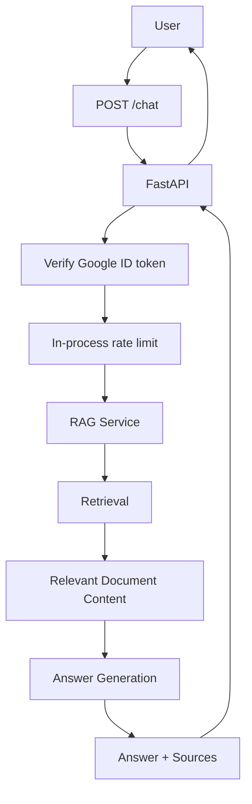

# Backend Technical Design

## Overview

The MedRep AI backend is responsible for receiving user questions, coordinating the question-answering flow, and returning answers with source information.

The backend is written in Python and uses FastAPI.

The current backend API is centered on:

`POST /chat` (deterministic RAG via `ask_rag`)

`POST /agent-chat` (multi-step LangChain agent over internal documents via `ask_agent`)

`GET /health` (unauthenticated liveness)

As the project grows, the backend will coordinate the RAG flow, document retrieval, and answer generation.

Product behavior is defined in `docs/product/requirements.md`.

Medical product domain concepts are defined in `docs/domain/medical-rep-domain.md`.

## Backend Responsibilities

The backend is responsible for:

- Receiving API requests.
- Validating incoming request data.
- Verifying Google ID tokens on protected endpoints (`POST /chat`, `POST /agent-chat`).
- Coordinating the RAG process and the internal-documents agent path.
- Retrieving relevant information from product documents.
- Sending retrieved context for answer generation.
- Returning generated answers.
- Returning source information with supported answers.
- Handling expected failures in a controlled way.
- Keeping API-specific logic separate from application logic as the project grows.
- Ingesting product PDFs from S3 into OpenSearch (shared ingest service used by CLI and S3-triggered Lambda).

The backend should not contain product or medical rules that are not defined by the product or domain documentation.

## Request Flow

The expected backend flow is:



At a high level:

1. The user submits a question to `POST /chat` with `Authorization: Bearer <Google ID token>`.
2. FastAPI receives the request, verifies the Google ID token (`GOOGLE_CLIENT_ID` audience), and validates the body.
3. After auth, an in-process sliding-window rate limit is checked (keyed by Google `sub`, or client IP if `sub` is missing).
4. The request is passed to the RAG logic.
5. Relevant product document content is retrieved.
6. The question and retrieved context are used for answer generation.
7. The generated answer is associated with its source information.
8. FastAPI returns the answer and sources to the caller.

## API Layer

FastAPI provides the backend API layer.

The current endpoints are:

### GET /health

Purpose:

Lightweight liveness check for the API process.

- Unauthenticated (no Google ID token required).
- Does **not** call Bedrock, OpenSearch, or other AI dependencies.
- Response: `{ "status": "ok" }` with HTTP 200.
- Includes `X-Request-ID` like other endpoints.

### POST /chat

Purpose:

Receive a user question and return the MedRep AI response.

The endpoint should remain focused on HTTP/API concerns such as:

- Receiving the request.
- Authenticating the caller (Google ID token).
- Applying the chat rate limit.
- Validating request data.
- Calling the appropriate application logic.
- Returning the result.
- Converting controlled failures into appropriate API responses.

The route handler should not contain the entire retrieval and answer-generation process as the project becomes larger.

Request/response Pydantic models live in `backend/api/schema/`. Google ID-token verification lives in `backend/api/auth.py` (`require_google_user`). In-process chat rate limiting lives in `backend/api/rate_limit.py` (`enforce_chat_rate_limit`). Request-ID middleware lives in `backend/api/middleware.py`. Consistent error envelopes and handlers live in `backend/api/errors.py`. `backend/main.py` loads configuration, creates the FastAPI app, registers CORS + request-ID middleware and exception handlers, and defines `GET /health`, `POST /chat`, and `POST /agent-chat`.

### Request ID

Every API response includes an `X-Request-ID` header for log/response correlation.

- Clients may send `X-Request-ID` on the request.
- The server accepts the value when it is safe: non-empty, at most 128 characters, printable ASCII without whitespace or control characters.
- Invalid or missing values are replaced with a generated UUID4.
- The resolved ID is stored on `request.state.request_id`, returned on the response as `X-Request-ID`, and included in error envelopes as `error.request_id`.
- Unexpected exceptions are logged with `request_id` (and path/method). Authorization tokens and full request bodies are not logged.

### Authentication (`POST /chat`, `POST /agent-chat`)

Protected endpoints (`POST /chat`, `POST /agent-chat`) require:

```http
Authorization: Bearer <Google ID token>
```

Configuration:

| Variable | Purpose |
| --- | --- |
| `GOOGLE_CLIENT_ID` | Expected Google OAuth Web Client ID (token audience). Same value as frontend `NEXT_PUBLIC_GOOGLE_CLIENT_ID`. |

Behavior:

- Missing, malformed, or non-Bearer `Authorization` → **401** (`UNAUTHORIZED` / `Not authenticated.`).
- Invalid, expired, or wrong-audience token → **401** (`UNAUTHORIZED` / `Invalid authentication credentials.`).
- `GOOGLE_CLIENT_ID` unset/empty → **500** (`INTERNAL_ERROR` / `Authentication is not configured.`) — fail closed.
- Valid token → request proceeds to the chat rate limit (then `ask_rag` or `ask_agent`); verified claims are available to the route but unused beyond rate-limit keying today.

Verification uses `google.oauth2.id_token.verify_oauth2_token` (signature, issuer, audience, expiry). Raw tokens must not be logged. Auth is isolated from `services/rag.py`. Application roles/RBAC are out of scope.

### Rate limiting (`POST /chat`, `POST /agent-chat`)

`POST /chat` and `POST /agent-chat` are rate-limited after authentication via an in-memory sliding window in `backend/api/rate_limit.py` (`enforce_chat_rate_limit`). `GET /health` is not rate-limited.

Configuration:

| Variable | Default | Purpose |
| --- | --- | --- |
| `CHAT_RATE_LIMIT_REQUESTS` | `20` | Max allowed requests per key within the window. Invalid or non-positive values fall back to the default. |
| `CHAT_RATE_LIMIT_WINDOW_SECONDS` | `60` | Sliding window length in seconds. Invalid or non-positive values fall back to the default. |

Behavior:

- Key: `user:{google sub}` when the verified token has a non-empty string `sub`; otherwise `ip:{client_host}` (or `ip:unknown` if no client address).
- Over limit → **429** (`TOO_MANY_REQUESTS` / `Rate limit exceeded. Try again later.`). RAG is not called.
- The limiter is **per API process**. Counts are not shared across multiple instances. Multi-instance deployments need a shared store or edge/WAF strategy (out of scope for this design).

### CORS

Browser clients (the MedRep Next.js app) call `POST /chat` (and may call `GET /health`) cross-origin. FastAPI registers `CORSMiddleware` in `backend/main.py` (`add_cors_middleware`). Request-ID middleware is registered after CORS so it is outermost.

Configuration:

| Variable | Purpose |
| --- | --- |
| `CORS_ALLOWED_ORIGINS` | Comma-separated exact origins allowed to call the API from a browser (whitespace stripped; empty segments dropped). No default — empty/missing → no origins allowed (fail closed). Local Next.js example: `http://localhost:3000` (see `backend/.env.example`). |

Middleware settings:

- `allow_origins` — parsed from `CORS_ALLOWED_ORIGINS` (no wildcard, no `allow_origin_regex`).
- `allow_credentials=False`
- `allow_methods` — `GET`, `POST`, `OPTIONS`
- `allow_headers` — `Authorization`, `Content-Type`, `Accept`, `X-Request-ID`
- `expose_headers` — `X-Request-ID`

Do not hard-code production hostnames; set the env var per environment.

### RAG module (`ask_rag`)

`backend/services/rag.py` provides `ask_rag(question)` which:

1. Embeds the question with Amazon Bedrock.
2. Searches Amazon OpenSearch (k-NN).
3. Sends retrieved context to Amazon Bedrock for generation.
4. Returns `{ "answer": "...", "source": "...", "context": "...", "citations": [...] }` (singular `source` string; `context` is combined top-k chunk text after exact-text dedupe, joined with blank lines; `source` is unique retrieved sources joined into one string; `citations` is a deduplicated list of structured metadata for chunks actually used in the generation context; both `source` and `citations` are empty when no hits, below threshold, guardrail-blocked, or unsupported).

The OpenSearch client lives in `backend/repositories/opensearch.py` and is shared by RAG and ingest.

Configuration uses environment variables (for example `AWS_REGION`, `BEDROCK_EMBEDDING_MODEL_ID`, `BEDROCK_GENERATION_MODEL_ID`, `OPENSEARCH_HOST`, `OPENSEARCH_INDEX`, `RAG_TOP_K`). Secrets are not hardcoded.

`POST /chat` calls `ask_rag(question)` and returns `{ "answer", "source", "citations" }` to clients (`context` is for offline eval reuse).

### Agent path (`ask_agent` / `POST /agent-chat`)

`POST /agent-chat` uses the same request/response models as `POST /chat` (`ChatRequest` / `ChatResponse`: `answer`, `source`, `citations`). It calls `ask_agent(question, model)` in `backend/services/agent.py`.

`ask_agent` is a multi-step LangChain agent loop (up to `MAX_AGENT_ROUNDS`) over **internal documents only**. The model may call `search_internal_documents` more than once (for example, to compare products). DailyMed is not on this path.

Behavior:

- Greetings and small talk may be answered without tools via model intent (system prompt); the Python gate allows a non-empty first-turn reply when no tool was invoked.
- Medical and product-information answers are instructed (system prompt) to require `search_internal_documents` and to answer only from retrieved internal-document evidence; after unsuccessful tool use or empty usable evidence, the gate returns a safe refusal. The Python gate does not classify or block all ungrounded first-turn product answers if the model skips tools.
- Unknown tools, tool errors, and missing usable evidence (after tool use) return safe refusals.
- Shared response/citation helpers live in `backend/services/chat_result.py`.
- `POST /chat` / `ask_rag()` remain the deterministic RAG path and are unchanged.

DailyMed-related modules may still exist in the codebase for other use; they are not wired into `ask_agent` or `POST /agent-chat`.

#### Offline RAG evaluation

`backend/eval/` runs golden cases from `backend/eval/cases.json` against one `ask_rag` result per case. Unit tests cover local load/validate and check logic without live AWS.

**Install** (eval-only deps; not used by Lambda/API):

```bash
cd backend
pip install -r requirements.txt -r requirements-eval.txt
```

**Configure** via `backend/.env` (or the environment) and standard AWS credentials. Required for a live run: `OPENSEARCH_HOST`, `AWS_REGION`, and usual Bedrock/OpenSearch settings (`OPENSEARCH_INDEX`, `BEDROCK_EMBEDDING_MODEL_ID`, `BEDROCK_GENERATION_MODEL_ID`, optional `BEDROCK_EVAL_MODEL_ID` for the DeepEval judge). Do not commit secrets.

**Run:**

```bash
cd backend
python -m eval.evaluate
# optional path: python -m eval.evaluate path/to/cases.json
```

**Cost:** A live run calls Bedrock for RAG (embed + generate) and again for DeepEval judges, so it incurs Bedrock usage/cost.

**Checks:** Deterministic checks compare `source` to `expected_source` and require each `expected_facts` string to appear in the answer (case-insensitive). DeepEval metrics (Faithfulness, Answer Relevancy, Contextual Relevancy) use a Bedrock judge on the same retrieval context; they are skipped when context is empty.

### POST /chat contract

Request:

```json
{
  "question": "What is Panadol used for?"
}
```

Response:

```json
{
  "answer": "...",
  "source": "...",
  "citations": [
    {
      "product_name": "ozempic",
      "document_type": "pdf",
      "source_filename": "ozempic.pdf",
      "s3_key": "ozempic/ozempic.pdf",
      "page_number": 3,
      "section_name": "Indications",
      "document_version": "v2",
      "effective_date": "2024-01-01"
    }
  ]
}
```

- Request body field: `question` (string).
- Response fields: `answer`, `source`, and `citations` from `ask_rag`.
  - `source` remains a singular string (may be empty or `null` when no documents are found or a guardrail intervenes).
  - `citations` is an array of structured citation objects for chunks actually used in the RAG context. Optional fields may be `null` when metadata is missing. Duplicates are removed deterministically (first-seen wins) by `(s3_key or source_filename or source, page_number, section_name)`. Empty for no-hit, below-threshold, guardrail-blocked, and unsupported-answer responses.

`POST /agent-chat` uses the same request and response JSON shape (`answer`, `source`, `citations`) via `ask_agent`. PDF ingestion is not an HTTP route; it is shared service code invoked by CLI and by an S3-triggered Lambda.

### Error response shape

Application-level API failures use a consistent JSON envelope (replacing FastAPI's default `{"detail": ...}` for handled application errors):

```json
{
  "error": {
    "code": "INTERNAL_ERROR",
    "message": "Something went wrong.",
    "request_id": "..."
  }
}
```

| Situation | Status | `error.code` | `error.message` |
| --- | --- | --- | --- |
| Request/body validation (`RequestValidationError`) | 422 | `VALIDATION_ERROR` | `Request validation failed.` |
| Missing/invalid auth | 401 | `UNAUTHORIZED` | Client-safe auth strings from `api.auth` |
| Auth misconfiguration | 500 | `INTERNAL_ERROR` | `Authentication is not configured.` |
| Chat rate limit exceeded | 429 | `TOO_MANY_REQUESTS` | `Rate limit exceeded. Try again later.` |
| RAG / agent / AI dependency failure from `POST /chat` or `POST /agent-chat` | 503 | `SERVICE_UNAVAILABLE` | `The AI service is temporarily unavailable.` |
| Other `HTTPException` | corresponding status | Mapped stable code (e.g. `NOT_FOUND`) | `HTTPException.detail` when a string |
| Unhandled exception | 500 | `INTERNAL_ERROR` | `Something went wrong.` (no internal exception text) |

`WWW-Authenticate` and other `HTTPException` response headers are preserved. Pydantic validation still runs; only the client-facing body is wrapped. The frontend prefers `error.message` and still accepts legacy `detail` when present.

### Document ingestion

`backend/services/ingest.py` indexes product PDFs from S3 into OpenSearch for RAG:

1. Download PDF bytes from S3.
2. Extract per-page text with PyPDF (1-based `page_number`).
3. Clean extracted text (normalize whitespace, drop nulls/form-feeds, light hyphenation fix).
4. Split into paragraph/section-aware chunks sized by **whitespace word tokens** (not character windows), with small token overlap. Page boundaries and section changes are hard breaks; packing prefers whole paragraphs under the token budget and only splits oversized paragraphs on sentences/words.
5. Embed each chunk with Amazon Titan Embeddings (`amazon.titan-embed-text-v2:0` by default, same as `services.rag.embed_question`).
6. Ensure OpenSearch mappings for ingest metadata (`put_mapping` for missing keyword/integer fields; fail clearly on type conflicts).
7. Delete any existing docs for the same deterministic `document_id` **and** legacy docs for the same filename that lack `document_id` (old `_id={filename}::{i}`), via search→delete with refresh between pages, then re-index (idempotent re-upload; empty extracts still delete then return 0).
8. Index each chunk with OpenSearch `id=chunk_id` and body including `text`, `source`, `embedding`, plus metadata fields below.
9. Verify an **exact** document count for that `document_id`.

| Setting | Default | Notes |
| --- | --- | --- |
| OpenSearch index | `medrep-index` | Override with `OPENSEARCH_INDEX` |
| Chunk size | 400 tokens | `DEFAULT_CHUNK_SIZE`; override with `INGEST_CHUNK_SIZE` or `--chunk-size` |
| Chunk overlap | 40 tokens | `DEFAULT_CHUNK_OVERLAP`; override with `INGEST_CHUNK_OVERLAP` or `--chunk-overlap`; must be `< chunk_size` |
| Token unit | whitespace words | stdlib `str.split()`; not tiktoken |
| Embedding model | `amazon.titan-embed-text-v2:0` | Override with `BEDROCK_EMBEDDING_MODEL_ID` |
| `document_id` | sha256(S3 key) hex | Stable for the same object key |
| `chunk_id` | `{document_id}:{index:04d}` | Used as OpenSearch `_id` |

Indexed document fields:

| Field | Type | Required | Notes |
| --- | --- | --- | --- |
| `text` | text | yes | Chunk text |
| `source` | keyword (or text+keyword) | yes | PDF filename; kept for RAG / `POST /chat` |
| `embedding` | knn_vector | yes | Titan embedding |
| `document_id` | keyword | yes | Deterministic hash of S3 key |
| `chunk_id` | keyword | yes | Deterministic per-chunk id |
| `product_name` | keyword | yes | First path segment when present (`ozempic/...`); else filename stem |
| `document_type` | keyword | yes | `pdf` |
| `source_filename` | keyword | yes | Same as `source` |
| `s3_key` | keyword | yes | Full object key |
| `page_number` | integer | yes | 1-based start page for the chunk |
| `section_name` | keyword | no | Best-effort heading heuristic |
| `document_version` | keyword | no | Best-effort from early pages |
| `effective_date` | keyword | no | Best-effort from early pages |

Reusable entry point: `ingest_pdf(bucket, key, …)` (CLI, Lambda, and tests).

CLI (demo PDF):

```bash
cd backend
python ingest.py --bucket <bucket> --key Demo-pain-relief.pdf
# or: python -m services.ingest --bucket <bucket> --key Demo-pain-relief.pdf
# Ozempic (operator): --key ozempic/<Ozempic-pdf-filename>.pdf
```

#### S3 → Lambda ingestion

When a PDF is uploaded to the configured MedRep S3 bucket, an S3 `ObjectCreated` notification invokes a thin Lambda (`backend/handlers/s3_ingest.py`) that:

1. Reads bucket and object key from the S3 event (URL-decodes the key).
2. Skips non-`.pdf` keys.
3. Calls `services.ingest.ingest_pdf(bucket, key)`.
4. Logs start/success/failure; re-raises on failure so Lambda surfaces the error.

IaC: `infra/template.yaml` (SAM) points function CodeUri and layer ContentUri at the repo root so `sam build --use-container` mounts `backend/`. A root `Makefile` copies only `backend/handlers/` into the function artifact and stages `python/services`, `python/repositories`, plus `requirements-ingest.txt` deps into the ingest layer. IAM (S3 GetObject, Bedrock `InvokeModel`, AOSS data-plane), environment variables, and S3 ObjectCreated trigger with suffix `.pdf` and optional prefix (default empty for bucket-root demos such as `Demo-pain-relief.pdf`) are unchanged.

Do not hardcode secrets or AWS credentials; use IAM roles and environment variables.

**Operator follow-up (not automated by agents):**

1. Deploy the SAM template (`sam build` / `sam deploy` — human-run).
2. Ensure the OpenSearch Serverless data-access policy includes the Lambda execution role (IAM on the role is necessary but often insufficient for AOSS).
3. Re-upload one PDF (objects present before the notification was configured are not auto-ingested; use backfill/re-upload).
4. Confirm chunks appear in `medrep-index`.

Environment: `S3_BUCKET`, `S3_PDF_KEY`, `OPENSEARCH_HOST`, `OPENSEARCH_INDEX`, `AWS_REGION`, plus standard AWS credentials for CLI. AOSS signing uses the same `AWSV4SignerAuth` path as RAG via `repositories.opensearch`.

## Service Layer

As the project grows, application logic should be separated from FastAPI route handlers.

The service layer can coordinate the main chat workflow without introducing unnecessary abstractions.

Its responsibilities may include:

- Receiving a validated question from the API layer.
- Coordinating the RAG flow.
- Passing the question to retrieval.
- Passing retrieved context to answer generation.
- Combining the generated answer with source information.
- Returning the result to the API layer.
- Handling expected application-level failures.

The RAG coordination entry point is `ask_rag(question)` in `backend/services/rag.py`. `POST /chat` calls it with the request question. The agent entry point is `ask_agent(question, model)` in `backend/services/agent.py`; `POST /agent-chat` calls it with a Bedrock chat model bound to `search_internal_documents`. Shared chat response/citation helpers live in `backend/services/chat_result.py`. Document ingestion lives in `backend/services/ingest.py`.

The project should keep this layer simple until additional complexity requires further separation.

## RAG Layer

The RAG layer is implemented as `ask_rag(question)` in `backend/services/rag.py` and provides answers grounded in product documents.

Its responsibility is to:

1. Receive the user's question.
2. Find relevant content from available product documents.
3. Provide the retrieved content as context for answer generation.
4. Generate an answer using the question and retrieved context.
5. Return the answer with source information.

RAG ingestion settings (issue #12):

- Document chunking strategy: page-aware, paragraph/section-aware packing under a whitespace-token budget (section and page hard breaks; oversized paragraphs split on sentences/words), with small token overlap
- Chunk size: 400 tokens (`INGEST_CHUNK_SIZE` / `--chunk-size`)
- Chunk overlap: 40 tokens (`INGEST_CHUNK_OVERLAP` / `--chunk-overlap`)
- Embedding model: `amazon.titan-embed-text-v2:0` (override with `BEDROCK_EMBEDDING_MODEL_ID`)
- Retrieval top-k value: **TBD** (runtime default via `RAG_TOP_K`, currently 3)
- Relevance threshold: **TBD**
- Behavior when retrieval quality is too low: controlled empty-source response from `ask_rag`

The RAG layer should avoid making these settings part of unrelated API logic.
Retrieval returns ingest metadata alongside `text` / `source` / `embedding` so `POST /chat` can include structured `citations`.

## Retrieval

Amazon OpenSearch stores ingested product document chunks for retrieval.

The retrieval step receives an embedding of the user's question and finds relevant content from the indexed product documents (k-NN on the `embedding` field).

The retrieved content will then be provided to the answer-generation step.

Current OpenSearch document shape for ingestion/retrieval:

- Index name: `medrep-index` (default; override with `OPENSEARCH_INDEX`)
- Retrieval fields: `text` (chunk text), `source` (PDF filename), `embedding` (vector), plus ingest metadata used for structured citations
- Ingest metadata fields: `document_id`, `chunk_id`, `product_name`, `document_type`, `source_filename`, `s3_key`, `page_number`, optional `section_name` / `document_version` / `effective_date`
- Idempotency: delete by `document_id` plus legacy same-filename docs without `document_id` (search→delete with refresh), then re-index with `_id=chunk_id`; empty re-upload still deletes; verify exact count
- Vector / k-NN index mapping details beyond this field set: **TBD**
- Retrieval top-k: env `RAG_TOP_K` (default 3); relevance threshold: **TBD**

## LLM Generation

Amazon Bedrock is planned for answer generation.

The generation step will receive:

- The user's question.
- Relevant context retrieved from product documents.

It will use this information to produce the answer returned by MedRep AI.

The generation model default in code is `amazon.nova-lite-v1:0` (`DEFAULT_GENERATION_MODEL_ID` in `backend/utils/constants.py`, override with `BEDROCK_GENERATION_MODEL_ID`); further prompt/tuning choices remain open.

Other generation settings are also **TBD**, including:

- Temperature.
- Maximum output tokens.
- Prompt structure.
- Context formatting.

These settings should be tested as the RAG implementation is developed.

## Error Handling

The backend should handle expected failures in a controlled way.

Examples include:

- Invalid request data.
- Retrieval failures.
- No suitable document information being found.
- Answer-generation failures.
- External service failures.
- Authentication or authorization failures (Google ID-token verification on `POST /chat` and `POST /agent-chat`).
- Chat rate-limit exceeded (429 from the in-process limiter on both chat endpoints).
- Ingest failures in Lambda (logged and re-raised so the invocation fails visibly).

The backend should avoid exposing unnecessary internal error details to users.

Useful diagnostic information should still be available for development and troubleshooting.

API failures use the `error` envelope described under **Error response shape** (stable `code`, client-safe `message`, `request_id`). Unexpected exceptions are logged with `request_id` and must not include Authorization tokens or full sensitive request bodies in logs. Internal exception details must not appear in 5xx response bodies.

## Configuration and Secrets

Credentials and secrets must not be hardcoded in source code.

Application configuration should be provided through appropriate environment or configuration mechanisms.

AWS credentials should use appropriate AWS credential mechanisms rather than being stored directly in application code.

Configuration may include values such as:

- Environment-specific settings.
- Model configuration.
- Retrieval configuration.
- Service connection information.
- `GOOGLE_CLIENT_ID` for Google ID-token audience verification on protected API routes.
- `CORS_ALLOWED_ORIGINS` for browser CORS allowlist (comma-separated origins; fail closed when empty).
- `CHAT_RATE_LIMIT_REQUESTS` / `CHAT_RATE_LIMIT_WINDOW_SECONDS` for in-process `POST /chat` and `POST /agent-chat` rate limiting (per API instance).

The final production configuration approach is **TBD**.

## Testing

Backend behavior should be covered by automated tests.

The project uses Test-Driven Development for feature development and bug fixes.

Tests should focus on observable backend behavior, including:

- Request validation.
- Chat workflow behavior.
- RAG coordination.
- Controlled failure behavior.
- Answer and source responses.
- S3 Lambda handler behavior with a sample ObjectCreated event (mocked `ingest_pdf`).

External dependencies should be isolated when appropriate so backend behavior can be tested reliably.

The full TDD workflow is defined separately and should not be duplicated in this document.

## Current State

### Implemented Now

- Python is the selected backend language.
- FastAPI is the selected backend framework.
- Package layout under `backend/`: `api/schema`, `services`, `repositories`, `models`, `utils`, `handlers`, `tests`.
- `POST /chat` accepts `{ "question": "..." }`, requires `Authorization: Bearer <Google ID token>`, applies in-process rate limiting, calls `ask_rag(question)`, and returns `{ "answer", "source", "citations" }`.
- `POST /agent-chat` uses the same auth, rate limit, and `ChatResponse` shape; calls `ask_agent` (multi-step LangChain agent, `search_internal_documents` only) and returns `{ "answer", "source", "citations" }`.
- `GET /health` returns `{ "status": "ok" }` without auth or AI dependency calls.
- Every response includes `X-Request-ID` (accept valid incoming or generate UUID4); error bodies use `{ "error": { "code", "message", "request_id" } }`.
- `backend/api/auth.py` verifies Google ID tokens with `google-auth` against `GOOGLE_CLIENT_ID` (`require_google_user` dependency).
- `backend/api/rate_limit.py` enforces a configurable in-memory sliding-window limit on `POST /chat` and `POST /agent-chat` (keyed by Google `sub`; per-instance only).
- CORS via `CORSMiddleware` and `CORS_ALLOWED_ORIGINS` (fail closed; Authorization/Content-Type/Accept/X-Request-ID; GET/POST/OPTIONS; expose `X-Request-ID`).
- `ask_rag(question)` in `backend/services/rag.py` implements embed → OpenSearch retrieve → Bedrock generate → `{answer, source, context, citations}`.
- `ask_agent(question, model)` in `backend/services/agent.py` runs a multi-step internal-documents agent loop; shared helpers in `backend/services/chat_result.py`.
- `backend/services/ingest.py` ingests S3 PDFs into OpenSearch `medrep-index` (page extract → clean → token chunk → Titan embed → idempotent index with metadata; `source` kept for RAG).
- S3 ObjectCreated Lambda handler `backend/handlers/s3_ingest.py` calls the shared ingest service.
- SAM template `infra/template.yaml` packages a thin `handlers`-only function zip plus an ingest layer (`python/services`, `python/repositories`, deps) via the repo-root Makefile; source of truth remains under `backend/`. IAM, env vars, and `.pdf` ObjectCreated trigger are unchanged (deploy is an operator step).
- SAM template `infra/api-template.yaml` hosts the FastAPI app on API Gateway HTTP API + Lambda via Mangum (`main.handler`); deploy steps are in `docs/api-deployment.md` (operator-run; stack is separate from ingest).

### Planned

- Answers that include source information from real documents end-to-end in production.
- Application roles / authorization (RBAC) if needed later.

### TBD

- Final Bedrock generation model and prompt design (code default exists).
- Whether 400/40 token chunk size/overlap should change after offline evaluation.
- Retrieval top-k tuning and relevance threshold.
- Generation settings (temperature, max tokens).
- Authorization / roles beyond Google ID-token gate.
- Retry behavior.
- Final configuration approach.
- Frontend static hosting (CloudFront/S3); API Lambda hosting is documented in `docs/api-deployment.md` (`infra/api-template.yaml`).
- OpenSearch k-NN mapping / vector dimension configuration details.

## Open Technical Questions

- Should the token chunk size (400) / overlap (40) be changed after evaluating Ozempic (and other) retrieval quality?
- What retrieval top-k value should be used in production?
- What relevance threshold should be used?
- How should the system behave when retrieval finds no sufficiently relevant content beyond the current empty-source response?
- What exact source information should `POST /chat` return if multiple chunks match?
- How should authorization be handled if different user roles are introduced?
- What retry behavior is appropriate for external service failures?
- What should the final production configuration approach be?
- What should the final deployment architecture be?
