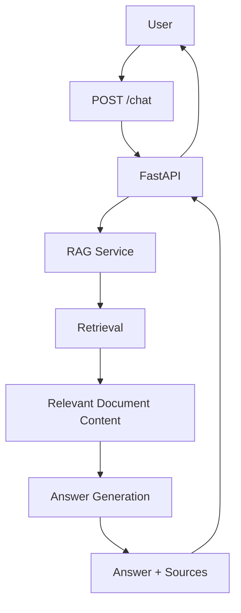

# Backend Technical Design

## Overview

The MedRep AI backend is responsible for receiving user questions, coordinating the question-answering flow, and returning answers with source information.

The backend is written in Python and uses FastAPI.

The current backend API is centered on:

`POST /chat`

As the project grows, the backend will coordinate the RAG flow, document retrieval, and answer generation.

Product behavior is defined in `docs/product/requirements.md`.

Medical product domain concepts are defined in `docs/domain/medical-rep-domain.md`.

## Backend Responsibilities

The backend is responsible for:

- Receiving API requests.
- Validating incoming request data.
- Handling authentication and authorization when authentication is added.
- Coordinating the RAG process.
- Retrieving relevant information from product documents.
- Sending retrieved context for answer generation.
- Returning generated answers.
- Returning source information with supported answers.
- Handling expected failures in a controlled way.
- Keeping API-specific logic separate from application logic as the project grows.

The backend should not contain product or medical rules that are not defined by the product or domain documentation.

## Request Flow

The expected backend flow is:



At a high level:

1. The user submits a question to `POST /chat`.
2. FastAPI receives and validates the request.
3. The request is passed to the RAG logic.
4. Relevant product document content is retrieved.
5. The question and retrieved context are used for answer generation.
6. The generated answer is associated with its source information.
7. FastAPI returns the answer and sources to the caller.

## API Layer

FastAPI provides the backend API layer.

The current endpoint is:

### POST /chat

Purpose:

Receive a user question and return the MedRep AI response.

The endpoint should remain focused on HTTP/API concerns such as:

- Receiving the request.
- Validating request data.
- Calling the appropriate application logic.
- Returning the result.
- Converting controlled failures into appropriate API responses.

The route handler should not contain the entire retrieval and answer-generation process as the project becomes larger.

### RAG module (`ask_rag`)

`backend/rag.py` provides `ask_rag(question)` which:

1. Embeds the question with Amazon Bedrock.
2. Searches Amazon OpenSearch (k-NN).
3. Sends retrieved context to Amazon Bedrock for generation.
4. Returns `{ "answer": "...", "source": "..." }` (singular `source` string).

Configuration uses environment variables (for example `AWS_REGION`, `BEDROCK_EMBEDDING_MODEL_ID`, `BEDROCK_GENERATION_MODEL_ID`, `OPENSEARCH_HOST`, `OPENSEARCH_INDEX`, `RAG_TOP_K`). Secrets are not hardcoded.

`POST /chat` calls `ask_rag(question)` and returns its `{ "answer", "source" }` result.

### POST /chat contract

Request:

```json
{
  "question": "What is Panadol used for?"
}
```

Response:

```json
{
  "answer": "...",
  "source": "..."
}
```

- Request body field: `question` (string).
- Response fields: `answer` and `source` from `ask_rag` (singular `source` string; may be empty when no documents are found).

No additional API endpoints are defined at this stage.

## Service Layer

As the project grows, application logic should be separated from FastAPI route handlers.

The service layer can coordinate the main chat workflow without introducing unnecessary abstractions.

Its responsibilities may include:

- Receiving a validated question from the API layer.
- Coordinating the RAG flow.
- Passing the question to retrieval.
- Passing retrieved context to answer generation.
- Combining the generated answer with source information.
- Returning the result to the API layer.
- Handling expected application-level failures.

The RAG coordination entry point is `ask_rag(question)` in `backend/rag.py`. `POST /chat` calls it with the request question.

The project should keep this layer simple until additional complexity requires further separation.

## RAG Layer

The RAG layer is implemented as `ask_rag(question)` in `backend/rag.py` and provides answers grounded in product documents.

Its responsibility is to:

1. Receive the user's question.
2. Find relevant content from available product documents.
3. Provide the retrieved content as context for answer generation.
4. Generate an answer using the question and retrieved context.
5. Return the answer with source information.

The following RAG decisions are not final:

- Document chunking strategy: **TBD**
- Chunk size: **TBD**
- Chunk overlap: **TBD**
- Embedding model: **TBD**
- Retrieval top-k value: **TBD**
- Relevance threshold: **TBD**
- Behavior when retrieval quality is too low: **TBD**

The RAG layer should avoid making these settings part of unrelated API logic.

## Retrieval

Amazon OpenSearch is planned for retrieving relevant product document content.

The retrieval step will receive information derived from the user's question and find relevant content from the indexed product documents.

The retrieved content will then be provided to the answer-generation step.

The final OpenSearch configuration is **TBD**.

This includes:

- Index structure: **TBD**
- Vector configuration: **TBD**
- Metadata fields: **TBD**
- Retrieval top-k: **TBD**
- Relevance threshold: **TBD**

No final index design should be assumed until these decisions are tested.

## LLM Generation

Amazon Bedrock is planned for answer generation.

The generation step will receive:

- The user's question.
- Relevant context retrieved from product documents.

It will use this information to produce the answer returned by MedRep AI.

The exact Bedrock model is **TBD**.

Other generation settings are also **TBD**, including:

- Temperature.
- Maximum output tokens.
- Prompt structure.
- Context formatting.

These settings should be tested as the RAG implementation is developed.

## Error Handling

The backend should handle expected failures in a controlled way.

Examples include:

- Invalid request data.
- Retrieval failures.
- No suitable document information being found.
- Answer-generation failures.
- External service failures.
- Authentication or authorization failures after authentication is added.

The backend should avoid exposing unnecessary internal error details to users.

Useful diagnostic information should still be available for development and troubleshooting.

Exact HTTP status codes, error schemas, retry behavior, and user-facing error messages are **TBD** unless they are defined elsewhere in the project.

## Configuration and Secrets

Credentials and secrets must not be hardcoded in source code.

Application configuration should be provided through appropriate environment or configuration mechanisms.

AWS credentials should use appropriate AWS credential mechanisms rather than being stored directly in application code.

Configuration may include values such as:

- Environment-specific settings.
- Model configuration.
- Retrieval configuration.
- Service connection information.

The final production configuration approach is **TBD**.

## Testing

Backend behavior should be covered by automated tests.

The project uses Test-Driven Development for feature development and bug fixes.

Tests should focus on observable backend behavior, including:

- Request validation.
- Chat workflow behavior.
- RAG coordination.
- Controlled failure behavior.
- Answer and source responses.

External dependencies should be isolated when appropriate so backend behavior can be tested reliably.

The full TDD workflow is defined separately and should not be duplicated in this document.

## Current State

### Implemented Now

- Python is the selected backend language.
- FastAPI is the selected backend framework.
- `POST /chat` accepts `{ "question": "..." }`, calls `ask_rag(question)`, and returns `{ "answer", "source" }`.
- `ask_rag(question)` in `backend/rag.py` implements embed → OpenSearch retrieve → Bedrock generate → `{answer, source}`.

### Planned

- Retrieval from real product PDF content.
- Answers that include source information from real documents.
- Authentication and authorization.

### TBD

- Service-layer structure.
- Bedrock model.
- Embedding model.
- Chunking strategy.
- Chunk size.
- Chunk overlap.
- Retrieval top-k.
- Relevance threshold.
- Prompt design.
- Generation settings.
- Authentication implementation.
- Error response format.
- Retry behavior.
- Final configuration approach.
- Final deployment architecture.

## Open Technical Questions

- Which Amazon Bedrock model should be used for answer generation?
- Which embedding model should be used?
- How should PDF content be divided into chunks?
- What chunk size should be used?
- Should chunks overlap, and if so, by how much?
- What retrieval top-k value should be used?
- What relevance threshold should be used?
- How should the system behave when retrieval finds no sufficiently relevant content?
- What metadata should be associated with retrieved document content?
- What exact source information should `POST /chat` return?
- What should the final request and response schemas look like?
- How should authentication be implemented?
- How should authorization be handled if different user roles are introduced?
- What retry behavior is appropriate for external service failures?
- What should the final production configuration approach be?
- What should the final deployment architecture be?